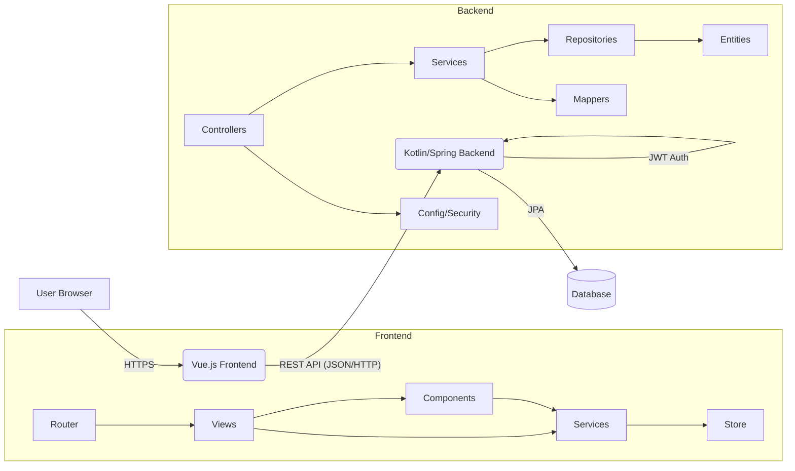

# Plan for README.md

This document outlines the plan for creating the main `README.md` for the Orders Management System project.

## 1. README.md Structure Outline

*   **Project Title:** (e.g., Orders Management System)
*   **Introduction:** Brief description of the project's purpose.
*   **Architecture Overview:**
    *   High-level diagram (using Mermaid).
    *   Description of the two main components: Backend (Kotlin/Spring) and Frontend (Vue.js).
    *   How they interact (REST API).
*   **Backend Architecture (Kotlin/Spring Boot):**
    *   Key layers/patterns (e.g., Controller-Service-Repository).
    *   Major modules/packages (e.g., `controller`, `service`, `entity`, `repository`, `config`, `dto`, `mapper`). Briefly describe the responsibility of each.
    *   Authentication mechanism (JWT).
*   **Frontend Architecture (Vue.js):**
    *   UI Framework (Vue 3).
    *   Build Tool (Vite).
    *   Routing (`vue-router`).
    *   State Management (Pinia/Vuex - confirmed only `customer.js` store exists).
    *   API Communication (`axios` via service modules).
    *   Key directories (`views`, `components`, `services`, `router`, `stores`). Briefly describe the purpose of each.
*   **Database Schema:**
    *   Brief overview of the main entities (`Customer`, `Item`, `Order`, `Truck`, `User`, `OrderItem`).
    *   Description of key relationships (e.g., One-to-Many, Many-to-One).
    *   Mention the use of JPA/Hibernate for ORM.
*   **API Endpoint Documentation:**
    *   List of main API endpoints grouped by resource (e.g., Customers, Orders, Items, Trucks, Auth, Dashboard).
    *   For key endpoints, include:
        *   HTTP Method (GET, POST, PUT, DELETE)
        *   Path (e.g., `/api/customers`, `/api/orders/{orderId}`)
        *   Brief Description (from `@Operation` annotations or inferred)
        *   Required Authentication (Yes/No)
        *   Example Request Body (DTO structure, if applicable)
        *   Example Success Response (DTO structure or status code)
*   **Technologies Used:** (List the main technologies for backend and frontend).

## 2. Proposed Mermaid Diagram (High-Level)

## 3. Next Steps for Implementation

*   Gather specific details for all sections based on codebase analysis.
*   Extract endpoint information from controller files.
*   Formulate descriptions and documentation.
*   Write the content into `README.md`.